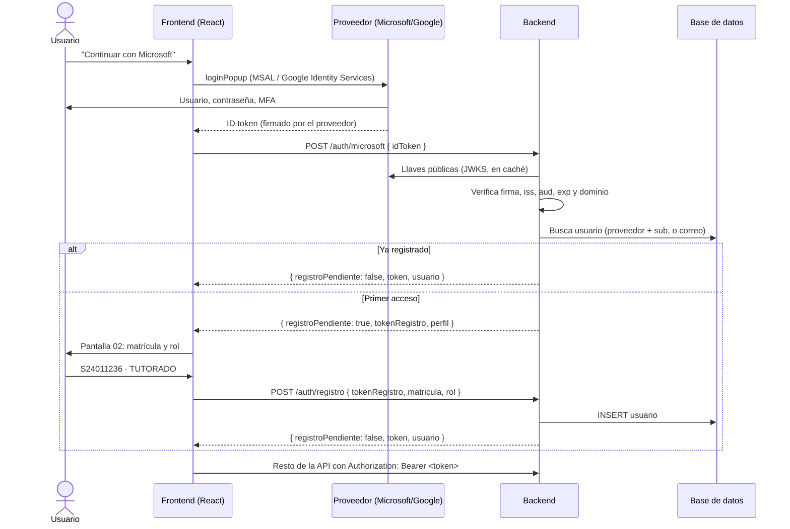

# Autenticación con proveedores externos

El sistema no maneja contraseñas. El usuario se identifica con su cuenta de **Microsoft** (institucional UV) o de **Google** (`gmail.com`). El backend verifica esa identidad y entrega su **propio JWT**, que es el que se usa en el resto de la API.

## 1. Cómo funciona

El estándar es **OpenID Connect** (OIDC), una capa de identidad sobre OAuth 2.0. Participan tres partes:

| Parte | Rol |
|---|---|
| **Proveedor** (Microsoft Entra ID / Google) | Pide usuario, contraseña y MFA, y emite un **ID token**. El sistema nunca ve la contraseña. |
| **Frontend** (React) | Abre la ventana del proveedor con su librería oficial y recibe el ID token. |
| **Backend** (Spring Boot) | Recibe el ID token, **verifica que sea auténtico**, busca o registra al usuario y entrega el JWT propio. |

El **ID token** es un JWT firmado por el proveedor con su llave privada (RS256). Contiene, entre otros:

| Claim | Significado |
|---|---|
| `iss` | Quién lo emitió (Google o el tenant de Microsoft). |
| `aud` | Para qué aplicación se emitió: debe ser **nuestro** Client ID. |
| `exp` | Expiración (≈1 hora). |
| `sub` | Identificador único y permanente de la persona en ese proveedor. |
| `email`, `name`, `given_name`, `family_name` | Datos del perfil. |
| `tid` | (Microsoft) Id del tenant, es decir, de la organización. |
| `email_verified` | (Google) Si el correo está verificado. |

### Por qué el backend puede confiar en el token

El backend descarga las **llaves públicas** del proveedor (JWKS) y comprueba la firma. Si alguien altera un solo carácter del token, la firma deja de ser válida. Después revisa `iss`, `aud`, `exp` y el dominio. Un token emitido para **otra** aplicación se rechaza por `aud`, aunque su firma sea válida.

| Proveedor | Llaves públicas (JWKS) |
|---|---|
| Google | `https://www.googleapis.com/oauth2/v3/certs` |
| Microsoft | `https://login.microsoftonline.com/{tenant}/discovery/v2.0/keys` |

Las llaves se guardan en caché. No hay que llamar al proveedor en cada request porque, después del login, la API usa el JWT propio.

### Flujo completo



### El primer acceso en dos pasos

`usuario.matricula` e `id_rol` son `NOT NULL`, así que el usuario no se puede crear solo con los datos del proveedor. Por eso:

1. `POST /auth/{proveedor}` verifica la identidad y, si el usuario no existe, devuelve un **`tokenRegistro`**. Es un JWT firmado por el backend, válido **15 minutos**, que contiene la identidad ya verificada: proveedor, `sub`, correo, nombre y apellidos.
2. `POST /auth/registro` recibe ese `tokenRegistro` junto con la matrícula y el rol. El backend toma nombre y correo **del token**, no del body; el frontend no puede alterarlos.

## 2. Reglas por proveedor

| | Microsoft | Google |
|---|---|---|
| Cuentas aceptadas | Tenant de la UV, correo `@estudiantes.uv.mx` | Correo `@gmail.com` |
| Validación clave | `tid` debe ser el tenant de la UV; después, dominio del correo | `email_verified = true` y correo termina en `@gmail.com` |
| `iss` esperado | `https://login.microsoftonline.com/{tid}/v2.0` | `https://accounts.google.com` o `accounts.google.com` |
| Id permanente | `sub` (o `oid` + `tid`) | `sub` |
| Nombre | `given_name` / `family_name` (claims opcionales; si faltan, se divide `name`) | `given_name` / `family_name` |

> **Importante (Microsoft):** no basta con revisar que el correo termine en `@estudiantes.uv.mx`. En aplicaciones multi-tenant, otra organización puede emitir tokens con un correo falso de ese dominio porque el claim `email` no está verificado. Primero se valida **`tid`** y después el dominio.

La matrícula **no** se compara con el correo; así se decidió por la limitación de Google.

## 3. Configuración necesaria

### Microsoft Entra ID

1. **App registration** en el portal de Azure → plataforma **SPA**, con redirect URI del frontend (`http://localhost:5173`, dominio de producción).
2. Tipo de cuenta:
   - **Ideal:** registrar la app **dentro del tenant de la UV** (single-tenant). Normalmente lo hace TI de la UV.
   - **Alternativa:** registrarla en un tenant propio como **multi-tenant** y validar `tid` = tenant UV en el backend. Riesgo: si la UV tiene deshabilitado el consentimiento de usuario, se necesitará consentimiento de un administrador de la UV.
3. Agregar claims opcionales `email`, `given_name` y `family_name` al ID token (Token configuration).
4. Tenant ID de la UV: se obtiene del campo `issuer` en `https://login.microsoftonline.com/estudiantes.uv.mx/v2.0/.well-known/openid-configuration`.

### Google

1. Google Cloud Console → **OAuth consent screen** (External) → **Credentials** → OAuth client ID tipo **Web application**, con *Authorized JavaScript origins* del frontend.
2. Mientras la app esté en modo **Testing**, solo los correos agregados como *test users* (máximo 100) pueden entrar. Esto sirve para el prototipo.

### Variables de entorno (backend)

| Variable | Uso |
|---|---|
| `GOOGLE_CLIENT_ID` | `aud` esperado en tokens de Google. |
| `MICROSOFT_CLIENT_ID` | `aud` esperado en tokens de Microsoft. |
| `MICROSOFT_TENANT_ID` | Tenant de la UV (valida `tid` e `iss`). |
| `API_KEY` | Firma del JWT propio (ya existe). |
| `API_JWT_EXPIRATION` | Vigencia del JWT propio en ms (ya existe). |

### Librerías

- **Frontend:** `@azure/msal-browser` (+ `@azure/msal-react`) y Google Identity Services (`@react-oauth/google`). Ambas entregan el ID token: MSAL en `result.idToken`, Google en `credential`.
- **Backend:** `spring-boot-starter-oauth2-resource-server` incluye `NimbusJwtDecoder`, que descarga y cachea las JWKS y valida firma y expiración. Se le agregan validadores de `iss`, `aud`, `tid` y dominio. No se usa el login con redirección de Spring (`oauth2-client`), porque el frontend obtiene el token.

## 4. JWT propio

Después de verificar al usuario, el backend emite su propio JWT (HS256, igual que hoy):

| Claim | Valor |
|---|---|
| `sub` | Matrícula (`"S23014587"`) |
| `rol` | `TUTORADO` · `TUTOR` · `ADMIN` |
| `iat`, `exp` | Emisión y expiración (`API_JWT_EXPIRATION`) |

- Se envía como `Authorization: Bearer <token>`.
- **Cerrar sesión:** el frontend descarta el token (la API no guarda sesiones). Opcionalmente también cierra la sesión del proveedor con `logoutPopup` de MSAL.
- Si el rol cambia en la BD, el cambio aplica en el siguiente login.

## 5. ¿La tabla `usuario` necesita un campo de proveedor?

**Sí, se recomienda.** Propuesta (detalle en [MODELO_DE_DATOS.md](MODELO_DE_DATOS.md#cambios-recomendados)):

```sql
ALTER TABLE usuario
  ADD COLUMN proveedor  varchar(20),   -- 'MICROSOFT' | 'GOOGLE'
  ADD COLUMN id_externo varchar(255);  -- claim 'sub' del proveedor
CREATE UNIQUE INDEX ON usuario (proveedor, id_externo);
```

Motivos:

1. **Identidad estable.** OIDC define `sub` como el identificador permanente. El correo puede cambiar y en Microsoft es un claim opcional y modificable. Si se busca al usuario solo por correo, un correo reasignado o falsificado daría acceso a la cuenta de otra persona.
2. **Saber con qué proveedor entra cada usuario.** La pantalla 02 muestra la insignia `MICROSOFT`. Además, un usuario queda ligado a un solo proveedor.
3. **Pre-registro de administradores.** Se puede insertar un usuario con `proveedor` e `id_externo` en `NULL`. En su primer login se encuentra por correo y se ligan esos campos (ver opción A abajo).

**Búsqueda en el login:**

1. Por `proveedor` + `id_externo`.
2. Si no hay resultado: por correo **solo** si esa fila tiene `id_externo IS NULL` (pre-registro), y se liga.
3. Si tampoco: primer acceso → `tokenRegistro`.

Si la misma persona entra después con el otro proveedor, su correo es distinto (los dominios no se cruzan). Se le pedirá registrarse y el registro fallará porque la matrícula ya existe: *"La matrícula ya está registrada con otra cuenta."*

## 6. Opciones para entrar al panel de administración

`POST /auth/registro` solo acepta `TUTORADO` y `TUTOR`. El rol `ADMIN` nunca se asigna desde la API.

### Opción A — Rol en BD con el mismo login (recomendada para el prototipo)

El admin entra con Microsoft o Google como cualquier usuario. Su fila tiene `id_rol` = ADMIN, el JWT lleva `rol: ADMIN` y el frontend lo manda al panel de administración.

```sql
-- A1. Pre-registro (antes de su primer login; se liga por correo al entrar)
INSERT INTO usuario (matricula, nombre, apellidos, correo, id_rol)
VALUES ('25480', 'Adriana', 'Salas Ortega', 'asalas@uv.mx',
        (SELECT id_rol FROM rol WHERE rol = 'ADMIN'));

-- A2. Promoción (ya se registró como tutor o tutorado)
UPDATE usuario SET id_rol = (SELECT id_rol FROM rol WHERE rol = 'ADMIN')
WHERE matricula = '25480';
```

- ✅ No hay que construir nada extra; usa la misma pantalla de login.
- ⚠️ Cambiar admins requiere acceso a la BD.

### Opción B — Lista blanca por configuración

Variable `ADMIN_CORREOS=asalas@uv.mx,otro@uv.mx`. En cada login, si el correo está en la lista, el rol se fuerza a `ADMIN` y se actualiza la BD.

- ✅ No requiere acceso a la BD; es auditable en la configuración del despliegue.
- ⚠️ Cambiar la lista requiere redesplegar o reiniciar.

### Opción C — Roles de aplicación de Microsoft Entra ID (para una versión formal)

En la App registration se define un *App role* `Admin`. TI de la UV lo asigna a personas o a grupos, y el ID token trae `roles: ["Admin"]`. El backend lo traduce a `ADMIN` en cada login.

- ✅ Altas y bajas centralizadas en la UV y revocación inmediata en el siguiente login. Es la opción más seria.
- ⚠️ Requiere que la app esté en el tenant de la UV y que TI participe. Solo funciona con cuentas Microsoft.

### Opción D — Credenciales locales separadas (no recomendada)

Usuario y contraseña propios del panel, con 2FA. Vuelve a introducir el manejo de contraseñas que se acaba de eliminar.

### Recomendación

- **Ahora:** opción A (pre-registro A1).
- **Al formalizar:** migrar a la opción C.
- **En ambos casos:**
  - mantener los endpoints de admin bajo `/admin/**` con `hasRole('ADMIN')`;
  - usar un JWT de menor vigencia para `ADMIN`;
  - registrar en una bitácora las acciones de admin (alta o baja de EE, desactivar tutorías).

## 7. Endpoints de autenticación

Ver detalle en [API.md § Autenticación](API.md#1-autenticación--auth-público).

| Método | Ruta | Uso |
|---|---|---|
| `POST` | `/auth/microsoft` | Login con ID token de Microsoft. |
| `POST` | `/auth/google` | Login con ID token de Google. |
| `POST` | `/auth/registro` | Completa el primer acceso (matrícula y rol). |
| `GET` | `/usuarios/me` | Datos del usuario autenticado. |
