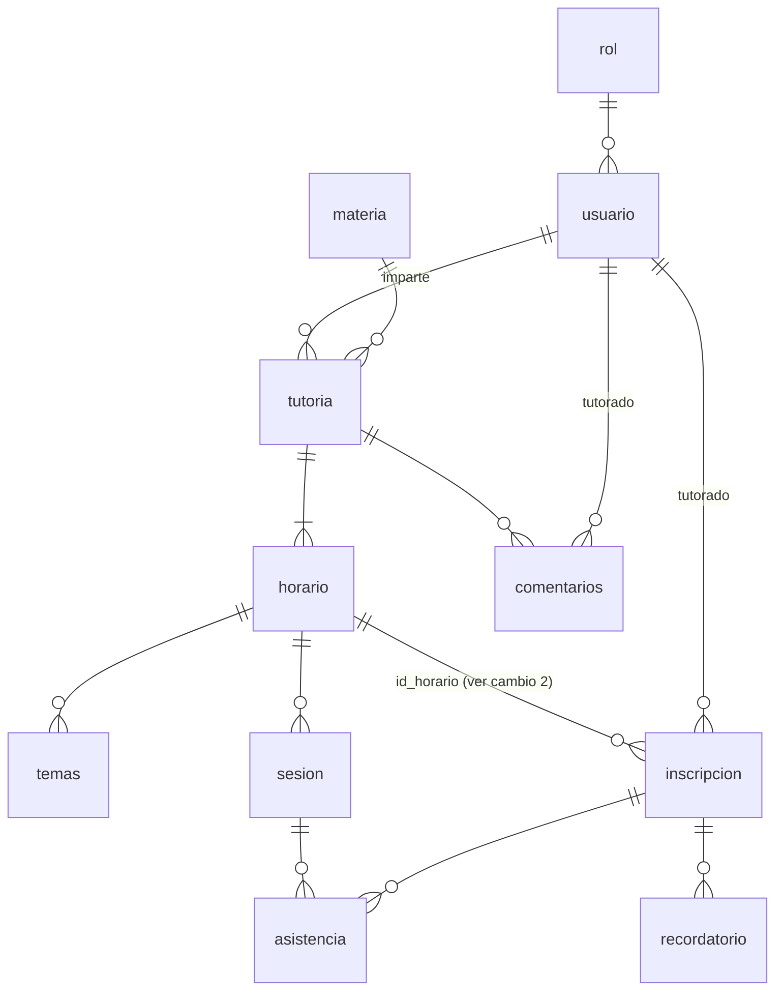

# Modelo de datos

Basado en `TutorConnect.sql` (export de dbdiagram). Motor: PostgreSQL. Se crea una **BD nueva**: no se migran datos, porque los actuales son de prueba.

## Tablas

| Tabla | Descripción | Columnas clave |
|---|---|---|
| `rol` | Catálogo de roles: `TUTORADO`, `TUTOR`, `ADMIN`. | `rol` único |
| `usuario` | Persona que entra con Microsoft o Google. Sin contraseña. | PK `matricula varchar(50)` (con `S`), `correo` único, `id_rol` |
| `materia` | Experiencia Educativa (EE). | `identificador` (= NRC) único |
| `tutoria` | Tutoría recurrente de un tutor sobre una EE, en un lugar fijo. | `id_materia`, `matricula_tutor`, `edificio`, `aula`, `estado` (`ACTIVA`/`INACTIVA`) |
| `horario` | Bloque semanal de la tutoría. | `id_tutoria`, `dia`, `hora_inicio`, `hora_fin`, `estado` (`ACTIVO`/`INACTIVO`) |
| `temas` | Temas de un horario (máx. 10, 60 caracteres). | `id_horario` |
| `inscripcion` | Inscripción de un tutorado. | `id_horario`, `matricula_tutorado`, `estado` (`ACTIVA`/`BAJA`/`BAJA_AUTOMATICA`), `fecha_inscripcion`, `fecha_baja` |
| `sesion` | Ocurrencia de un horario en una fecha; solo existe al abrir la lista o al cancelar. | único (`id_horario`, `fecha`); `fecha_cancelada`, `fecha_lista_abierta`, `fecha_lista_cerrada` |
| `asistencia` | Marca de un inscrito en una sesión. | único (`id_sesion`, `id_inscripcion`); `asistio boolean NOT NULL` |
| `recordatorio` | Registro de recordatorios enviados (evita duplicados). | único (`id_inscripcion`, `fecha`) |
| `comentarios` | Sugerencias de tutorados por tutoría. | `matricula_tutorado`, `id_tutoria`, `fecha_comentario` |



**Respecto al esquema anterior:**

- **Se eliminan:** `permisos`, `usuario.pwd`, `asistencia.calificacion`.
- **Cambian:**
  - `apellidoP` y `apellidoM` se unen en `apellidos`;
  - `matricula` vuelve a `varchar`;
  - `materia.nrc` pasa a `identificador`.
- **Se agregan:** `sesion`, `inscripcion`, `recordatorio`.

---

## Cambios recomendados

Ninguno de estos cambios altera el contrato de la API documentada en [API.md](API.md); son mejoras internas. Están ordenados por importancia.

### 1. `usuario`: proveedor e id externo (recomendado)

Explicación completa en [AUTENTICACION.md § 5](AUTENTICACION.md#5-la-tabla-usuario-necesita-un-campo-de-proveedor).

```sql
ALTER TABLE usuario
  ADD COLUMN proveedor  varchar(20)  CHECK (proveedor IN ('MICROSOFT', 'GOOGLE')),
  ADD COLUMN id_externo varchar(255);
CREATE UNIQUE INDEX ux_usuario_proveedor_id ON usuario (proveedor, id_externo);
```

Las dos columnas son *nullable* para permitir el pre-registro de administradores.

### 2. `inscripcion`: ligarla a la tutoría en lugar de al horario (recomendado)

**Pregunta:** "Te inscribes a la tutoría, pero tu baja se basa en los horarios a los que faltaste. ¿Se recomiendan cambios?"

**Respuesta: sí.** Conviene cambiar `inscripcion.id_horario` por `inscripcion.id_tutoria`. El dato de "a qué horario faltaste" no se pierde, porque ya está en `asistencia → sesion → horario`.

| | Una fila por horario (esquema actual) | Una fila por tutoría (recomendado) |
|---|---|---|
| Inscribirse | N inserts (uno por horario) en una transacción | 1 insert |
| Darse de baja / baja automática | Actualizar N filas; si falla a medias, quedan estados mezclados | Actualizar 1 fila |
| Cupo | `COUNT(DISTINCT matricula)` sobre todos los horarios | `COUNT(*)` |
| Evitar doble inscripción | Índice parcial por horario; no impide estar en un horario sí y en otro no | Índice único parcial (`id_tutoria`, `matricula`) `WHERE estado='ACTIVA'` |
| ¿Aporta información? | No: los horarios solo cambian sin inscritos (RN-5), así que todo inscrito está siempre en **todos** los horarios | — |
| Saber en qué horario faltó | `asistencia → inscripcion → horario` | `asistencia → sesion → horario` |

```sql
ALTER TABLE inscripcion DROP COLUMN id_horario;
ALTER TABLE inscripcion ADD COLUMN id_tutoria int NOT NULL REFERENCES tutoria (id_tutoria);
CREATE UNIQUE INDEX ux_inscripcion_activa
  ON inscripcion (id_tutoria, matricula_tutorado) WHERE estado = 'ACTIVA';

-- Una tutoría puede tener dos horarios el mismo día; el recordatorio se distingue por horario
ALTER TABLE recordatorio ADD COLUMN id_horario int NOT NULL REFERENCES horario (id_horario);
DROP INDEX IF EXISTS recordatorio_id_inscripcion_fecha_idx;
CREATE UNIQUE INDEX ux_recordatorio ON recordatorio (id_inscripcion, id_horario, fecha);
```

**Si se mantiene una fila por horario**, el backend debe:

- crear todas las filas en una sola transacción, con el mismo `fecha_inscripcion`;
- dar de baja todas a la vez;
- reemplazar el índice no único por:

  ```sql
  CREATE UNIQUE INDEX ux_inscripcion_activa
    ON inscripcion (id_horario, matricula_tutorado) WHERE estado = 'ACTIVA';
  ```

### 3. Catálogo de edificios y aulas [S8]

Las columnas `tutoria.edificio` y `tutoria.aula` son `int` sin catálogo. Como la lista viene de otra base de datos, se propone importarla a una tabla y validarla con una FK compuesta. Las columnas de `tutoria` no cambian.

```sql
CREATE TABLE aula (
  edificio int NOT NULL,
  aula     int NOT NULL,
  PRIMARY KEY (edificio, aula)
);
ALTER TABLE tutoria
  ADD FOREIGN KEY (edificio, aula) REFERENCES aula (edificio, aula);
```

Alimenta `GET /catalogos/edificios`. Si el catálogo debe consultarse en vivo de la otra BD, hay que definir cómo conectarse a ella.

### 4. `sesion`: marca del aviso de lista sin cerrar [S7]

Permite enviar el aviso al tutor **una sola vez**, aunque el proceso corra cada minuto.

```sql
ALTER TABLE sesion ADD COLUMN fecha_aviso_cierre timestamptz;
```

### 5. Restricciones de integridad

```sql
ALTER TABLE tutoria     ADD CHECK (estado IN ('ACTIVA', 'INACTIVA'));
ALTER TABLE horario     ADD CHECK (estado IN ('ACTIVO', 'INACTIVO'));
ALTER TABLE horario     ADD CHECK (dia IN ('LUNES', 'MARTES', 'MIERCOLES', 'JUEVES', 'VIERNES'));
ALTER TABLE horario     ADD CHECK (hora_inicio < hora_fin);
ALTER TABLE sesion      ADD CHECK (hora_inicio < hora_fin);
ALTER TABLE inscripcion ADD CHECK (estado IN ('ACTIVA', 'BAJA', 'BAJA_AUTOMATICA'));
ALTER TABLE inscripcion ADD CHECK ((estado = 'ACTIVA') = (fecha_baja IS NULL));
ALTER TABLE sesion      ADD CHECK (fecha_cancelada IS NULL OR fecha_lista_abierta IS NULL);
ALTER TABLE sesion      ADD CHECK (fecha_lista_cerrada IS NULL OR fecha_lista_abierta IS NOT NULL);
```

### 6. Datos iniciales

```sql
INSERT INTO rol (rol) VALUES ('TUTORADO'), ('TUTOR'), ('ADMIN');
```

Las Experiencias Educativas se cargan desde la pantalla 16 o con un seed nuevo. El seed actual `db/seeds/S001__materias_admin_plan_2019.sql` usa la columna `nrc` y se tendrá que ajustar a `identificador`.

### Notas

- **Borrado:** ninguna FK tiene `ON DELETE CASCADE`. Esto es intencional: el historial (sesiones, asistencias, inscripciones) nunca se borra en cascada. Por eso eliminar una EE con tutorías falla (ver `DELETE /materias/{id}`) y los horarios se desactivan en vez de borrarse.
- **Zona horaria:** las columnas `timestamptz` guardan el instante absoluto. Las columnas `date` y `time` (`sesion.fecha`, `horario.hora_inicio`) se interpretan en `America/Mexico_City`.

---

## Esquema recibido (`TutorConnect.sql`)

<details>
<summary>Ver DDL completo</summary>

```sql
CREATE TABLE "tutoria" (
  "id_tutoria" INT GENERATED BY DEFAULT AS IDENTITY PRIMARY KEY,
  "id_materia" int NOT NULL,
  "matricula_tutor" varchar(50) NOT NULL,
  "edificio" int NOT NULL,
  "aula" int NOT NULL,
  "estado" varchar(50) NOT NULL
);

CREATE TABLE "materia" (
  "id_materia" INT GENERATED BY DEFAULT AS IDENTITY PRIMARY KEY,
  "materia" varchar(100) NOT NULL,
  "identificador" int UNIQUE NOT NULL
);

CREATE TABLE "inscripcion" (
  "id_inscripcion" INT GENERATED BY DEFAULT AS IDENTITY PRIMARY KEY,
  "id_horario" int NOT NULL,
  "matricula_tutorado" varchar(50) NOT NULL,
  "fecha_inscripcion" timestamptz NOT NULL,
  "estado" varchar(50) NOT NULL,
  "fecha_baja" timestamptz
);

CREATE TABLE "horario" (
  "id_horario" INT GENERATED BY DEFAULT AS IDENTITY PRIMARY KEY,
  "id_tutoria" int NOT NULL,
  "dia" varchar(50) NOT NULL,
  "hora_inicio" time NOT NULL,
  "hora_fin" time NOT NULL,
  "estado" varchar(50) NOT NULL
);

CREATE TABLE "usuario" (
  "matricula" varchar(50) PRIMARY KEY NOT NULL,
  "nombre" varchar(50) NOT NULL,
  "apellidos" varchar(200) NOT NULL,
  "correo" varchar(255) UNIQUE NOT NULL,
  "id_rol" int NOT NULL
);

CREATE TABLE "rol" (
  "id_rol" INT GENERATED BY DEFAULT AS IDENTITY PRIMARY KEY,
  "rol" varchar(50) UNIQUE NOT NULL
);

CREATE TABLE "temas" (
  "id_tema" INT GENERATED BY DEFAULT AS IDENTITY PRIMARY KEY,
  "tema" varchar(60) NOT NULL,
  "id_horario" int NOT NULL
);

CREATE TABLE "comentarios" (
  "id_comentario" INT GENERATED BY DEFAULT AS IDENTITY PRIMARY KEY,
  "matricula_tutorado" varchar(50) NOT NULL,
  "comentario" varchar(255) NOT NULL,
  "id_tutoria" int NOT NULL,
  "fecha_comentario" timestamptz NOT NULL
);

CREATE TABLE "asistencia" (
  "id_asistencia" INT GENERATED BY DEFAULT AS IDENTITY PRIMARY KEY,
  "id_sesion" int NOT NULL,
  "id_inscripcion" int NOT NULL,
  "asistio" boolean NOT NULL
);

CREATE TABLE "sesion" (
  "id_sesion" INT GENERATED BY DEFAULT AS IDENTITY PRIMARY KEY,
  "id_horario" int NOT NULL,
  "fecha" date NOT NULL,
  "hora_inicio" time NOT NULL,
  "hora_fin" time NOT NULL,
  "fecha_cancelada" timestamptz,
  "fecha_lista_abierta" timestamptz,
  "fecha_lista_cerrada" timestamptz
);

CREATE TABLE "recordatorio" (
  "id_recordatorio" INT GENERATED BY DEFAULT AS IDENTITY PRIMARY KEY,
  "id_inscripcion" int NOT NULL,
  "fecha" date NOT NULL,
  "fecha_envio" timestamptz NOT NULL
);

CREATE INDEX ON "inscripcion" ("id_horario", "matricula_tutorado");
CREATE UNIQUE INDEX ON "asistencia" ("id_sesion", "id_inscripcion");
CREATE UNIQUE INDEX ON "sesion" ("id_horario", "fecha");
CREATE UNIQUE INDEX ON "recordatorio" ("id_inscripcion", "fecha");

ALTER TABLE "tutoria" ADD FOREIGN KEY ("id_materia") REFERENCES "materia" ("id_materia") DEFERRABLE INITIALLY IMMEDIATE;
ALTER TABLE "tutoria" ADD FOREIGN KEY ("matricula_tutor") REFERENCES "usuario" ("matricula") DEFERRABLE INITIALLY IMMEDIATE;
ALTER TABLE "inscripcion" ADD FOREIGN KEY ("id_horario") REFERENCES "horario" ("id_horario") DEFERRABLE INITIALLY IMMEDIATE;
ALTER TABLE "inscripcion" ADD FOREIGN KEY ("matricula_tutorado") REFERENCES "usuario" ("matricula") DEFERRABLE INITIALLY IMMEDIATE;
ALTER TABLE "horario" ADD FOREIGN KEY ("id_tutoria") REFERENCES "tutoria" ("id_tutoria") DEFERRABLE INITIALLY IMMEDIATE;
ALTER TABLE "usuario" ADD FOREIGN KEY ("id_rol") REFERENCES "rol" ("id_rol") DEFERRABLE INITIALLY IMMEDIATE;
ALTER TABLE "temas" ADD FOREIGN KEY ("id_horario") REFERENCES "horario" ("id_horario") DEFERRABLE INITIALLY IMMEDIATE;
ALTER TABLE "comentarios" ADD FOREIGN KEY ("matricula_tutorado") REFERENCES "usuario" ("matricula") DEFERRABLE INITIALLY IMMEDIATE;
ALTER TABLE "comentarios" ADD FOREIGN KEY ("id_tutoria") REFERENCES "tutoria" ("id_tutoria") DEFERRABLE INITIALLY IMMEDIATE;
ALTER TABLE "asistencia" ADD FOREIGN KEY ("id_sesion") REFERENCES "sesion" ("id_sesion") DEFERRABLE INITIALLY IMMEDIATE;
ALTER TABLE "asistencia" ADD FOREIGN KEY ("id_inscripcion") REFERENCES "inscripcion" ("id_inscripcion") DEFERRABLE INITIALLY IMMEDIATE;
ALTER TABLE "sesion" ADD FOREIGN KEY ("id_horario") REFERENCES "horario" ("id_horario") DEFERRABLE INITIALLY IMMEDIATE;
ALTER TABLE "recordatorio" ADD FOREIGN KEY ("id_inscripcion") REFERENCES "inscripcion" ("id_inscripcion") DEFERRABLE INITIALLY IMMEDIATE;
```

</details>
