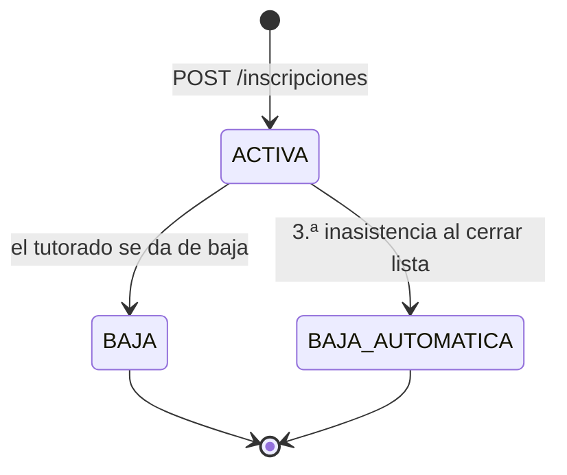
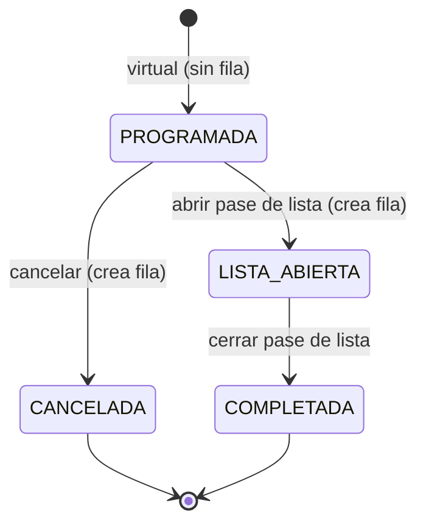

# Reglas de negocio

Reglas que aplica el backend. Los endpoints de [API.md](API.md) las citan como **RN-x**. Toda regla de tiempo se evalúa en `America/Mexico_City`.

## Constantes

| Constante | Valor |
|---|---|
| `CUPO_MAXIMO` | 7 tutorados por tutoría |
| `INASISTENCIAS_PERMITIDAS` | 2 (la 3.ª causa baja automática) |
| `MINUTOS_LIMITE_CANCELACION` | 15 minutos antes del inicio |
| `HORAS_RECORDATORIO` | 2 horas antes del inicio |
| `MAX_TEMAS_POR_HORARIO` | 10 |
| `MAX_CARACTERES_TEMA` | 60 |
| `MAX_CARACTERES_COMENTARIO` | 255 |
| `DIAS_PERMITIDOS` | `LUNES` a `VIERNES` |

---

## Tutorías y horarios

### RN-1 · Horarios válidos
- `dia` ∈ `LUNES`…`VIERNES`. No hay rango de horas restringido.
- `horaInicio < horaFin`.
- Una tutoría necesita **al menos un** horario `ACTIVO`.
- Dos horarios **se traslapan** si son el mismo día y `a.inicio < b.fin && b.inicio < a.fin`. Los horarios contiguos (10:00–12:00 y 12:00–14:00) **no** se traslapan.
- Los horarios de una misma tutoría no se pueden traslapar entre sí.

### RN-2 · Sin choques al crear o editar
Solo cuentan los horarios `ACTIVO` de tutorías `ACTIVA`:
- **Tutor:** un horario nuevo no se traslapa con los de sus otras tutorías.
- **Aula:** no se traslapa con los horarios de cualquier tutoría con el mismo `edificio` + `aula`.

### RN-5 · Edición de una tutoría
| Qué | ¿Con inscritos activos? |
|---|---|
| Horarios (agregar, quitar, cambiar día u horas) | ❌ Solo sin inscritos |
| Edificio y aula | ❌ Solo sin inscritos [S2] |
| Temas de un horario | ✅ Siempre (tutoría `ACTIVA`) |
| Experiencia Educativa | ❌ Nunca |

- `horario.estado`: `ACTIVO` · `INACTIVO`. Los horarios **nunca se borran físicamente**. Quitar un horario o cambiar su día u horas lo deja `INACTIVO` (y crea uno nuevo si aplica); así las sesiones y asistencias pasadas siguen apuntando a datos válidos.
- No se puede editar mientras haya un pase de lista abierto.

### RN-13 · Estado de la tutoría
`tutoria.estado`: `ACTIVA` · `INACTIVA`.

- La desactiva el **tutor** (ya no quiere impartirla) o el **admin** (una a una, o todas con el cierre de periodo).
- No hay reactivación [S3].
- No se puede desactivar con un pase de lista abierto.
- Una tutoría `INACTIVA`:
  - no aparece en "Explorar" ni acepta inscripciones;
  - no genera sesiones virtuales ni recordatorios;
  - no acepta comentarios ni cambios de temas;
  - conserva todo su historial.
- Al desactivarla se envía un correo a los inscritos activos. Sus inscripciones conservan el estado `ACTIVA`, y en la vista del tutorado aparecen en "Inscripciones anteriores" [S3].

---

## Inscripciones

### RN-3 · Cupo
- Cupo fijo de **7** por tutoría.
- `ocupados` = número de tutorados distintos con inscripción `ACTIVA` en la tutoría.
- La inscripción toma un **bloqueo** sobre la tutoría (`SELECT … FOR UPDATE`) antes de contar. Así dos inscripciones simultáneas no pueden superar el cupo.

### RN-4 · Sin choque de horarios para el tutorado
Un tutorado no puede inscribirse a una tutoría si alguno de sus horarios `ACTIVO` se traslapa (RN-1) con los horarios `ACTIVO` de otra tutoría `ACTIVA` donde tenga una inscripción `ACTIVA`.

### RN-12 · Estados de la inscripción y reinscripción

| Estado | Significado | ¿Puede volver a inscribirse? |
|---|---|---|
| `ACTIVA` | Inscrito; ocupa lugar. | — |
| `BAJA` | Baja voluntaria; libera el lugar. | ✅ Sí. Se crea una inscripción nueva y las inasistencias empiezan en 0 [S4]. |
| `BAJA_AUTOMATICA` | Acumuló 3 inasistencias; libera el lugar. | ❌ No, en esa tutoría. |

- La inscripción es **a la tutoría**: incluye todos sus horarios `ACTIVO`.
- "NUEVA" no es un estado. La UI la muestra mientras no haya ninguna sesión `COMPLETADA` desde la inscripción.
- `fecha_baja` se llena al pasar a `BAJA` o `BAJA_AUTOMATICA`.

---

## Sesiones y pase de lista

### RN-6 · Ciclo de vida de la sesión
Cada horario `ACTIVO` produce una ocurrencia por semana. **La fila en `sesion` solo se crea** al abrir el pase de lista o al cancelar. Mientras no tiene fila, la sesión es **virtual**: se calcula a partir del horario y la fecha.

`hora_inicio` y `hora_fin` siempre se copian del horario al crear la fila.

El estado **se deriva** de las columnas, no se guarda:

| Estado | Condición |
|---|---|
| `CANCELADA` | `fecha_cancelada IS NOT NULL` |
| `COMPLETADA` | `fecha_lista_cerrada IS NOT NULL` |
| `LISTA_ABIERTA` | `fecha_lista_abierta IS NOT NULL` y `fecha_lista_cerrada IS NULL` |
| `PROGRAMADA` | Sin fila (virtual), fecha de hoy o futura |

- Las ocurrencias **pasadas que nunca se abrieron** no existen: no se listan y no cuentan para nada [S1].
- Las ocurrencias virtuales solo se generan para fechas de hoy en adelante.

### RN-7 · Abrir pase de lista
- Lo abre el tutor dueño, en tutoría `ACTIVA` y horario `ACTIVO`.
- Solo el **mismo día** de la sesión [S1] y **cuando ya inició** (`ahora ≥ fecha + horaInicio`).
- Si ya existe con `LISTA_ABIERTA`, la operación es idempotente.
- Al abrirla se crean la fila de `sesion` y, conforme el tutor marca, las filas de `asistencia`.

### RN-8 · Cancelar sesión
- Solo sesiones `PROGRAMADA` (sin pase de lista abierto ni cerrado).
- Hasta **15 minutos antes** del inicio.
- Crea la fila con `fecha_cancelada`.
- Se envía un correo a los inscritos activos y no se envía el recordatorio.
- No cuenta para inasistencias ni para el porcentaje de asistencia.
- No se puede deshacer.

### RN-9 · Marcar y cerrar el pase de lista
- **Marcar:** solo con la lista abierta. Cada marca es `asistio = true | false`. "Sin marca" significa que no hay fila en `asistencia` (la columna es `NOT NULL`).
- **Lista de tutorados:** inscritos con estado `ACTIVA` en el momento de la consulta, más cualquiera que ya tenga marca en esa sesión.
- **Cerrar** requiere:
  1. todos los inscritos activos tienen marca;
  2. la sesión ya inició;
  3. la sesión no está cancelada.
- Al cerrar: `fecha_lista_cerrada = ahora`, la lista deja de ser editable y se calculan las bajas automáticas (RN-11).
- **No se cierra automáticamente.** Si llega `horaFin` y la lista sigue abierta, se envía **un aviso por correo al tutor** [S7]. Además, la UI muestra la advertencia (`Sesion.terminada`) y las listas de días anteriores aparecen en `listasSinCerrar`.

### RN-10 · Conteo de inasistencias
- Inasistencia = marca `asistio = false` en una sesión `COMPLETADA`.
- Se cuentan **por tutoría**, sumando todos sus horarios, y solo desde la `fecha_inscripcion` de la inscripción vigente [S4].
- No cuentan: sesiones canceladas, sesiones con la lista abierta (hasta que se cierre) y sesiones sin marca del tutorado.

### RN-11 · Baja automática
- Al **cerrar** un pase de lista, a cada tutorado con inscripción `ACTIVA` cuyo total de inasistencias (RN-10) sea **> 2**:
  - su inscripción pasa a `BAJA_AUTOMATICA`, con `fecha_baja = ahora`;
  - se libera su lugar;
  - se envía un correo al tutorado y otro al tutor.
- "En riesgo de baja" = exactamente 2 inasistencias.
- Tras una baja automática no se puede volver a inscribir a esa tutoría (RN-12).

---

## Indicadores

### RN-14 · Porcentaje de asistencia
`asistenciaPct = round(marcas con asistio=true / total de marcas × 100)`, considerando solo sesiones `COMPLETADA` de la tutoría. Es `null` si todavía no hay marcas.

- Ejemplo de la pantalla 14: 30 de 35 marcas → **86 %**.
- El admin ve el porcentaje por tutoría. El tutorado ve sus conteos ("Sesiones con asistencia", "Inasistencias", "Sesiones canceladas").

---

## Temas y comentarios

### RN-15 · Temas
- Pertenecen a un **horario**: los tutorados ven los temas "del martes" en las sesiones del martes.
- De 1 a 60 caracteres, máximo 10 por horario, sin repetirse en el mismo horario (sin distinguir mayúsculas).
- Editables por el tutor dueño aunque haya inscritos, mientras la tutoría esté `ACTIVA` y el horario `ACTIVO`.

### RN-16 · Comentarios
- Pertenecen a la **tutoría**. Los publica un tutorado con inscripción `ACTIVA`, en una tutoría `ACTIVA`.
- De 1 a 255 caracteres; `fecha_comentario` = momento de publicación.
- Cualquier usuario autenticado puede leerlos.
- Los borra su autor o un ADMIN [S6].

---

## Procesos automáticos y correos

### RN-17 · Recordatorio 2 horas antes
Un proceso programado (cada minuto) hace lo siguiente:

1. Toma los horarios `ACTIVO` de tutorías `ACTIVA` cuyo `dia` es hoy y cuya hora de inicio cumple `ahora ≥ horaInicio − 2 h` y `ahora < horaInicio`.
2. Descarta las sesiones que tengan fila con `fecha_cancelada` para hoy.
3. Por cada inscripción `ACTIVA` que **no** tenga un `recordatorio` para (`id_inscripcion`, hoy):
   - envía el correo;
   - inserta la fila (`fecha` = hoy, `fecha_envio` = ahora).
4. El índice único (`id_inscripcion`, `fecha`) evita duplicados aunque el proceso corra dos veces. Con el cambio 2 de [MODELO_DE_DATOS.md](MODELO_DE_DATOS.md#cambios-recomendados), la llave pasa a ser (`id_inscripcion`, `id_horario`, `fecha`).

Si alguien se inscribe a menos de 2 horas del inicio, recibe el recordatorio en la siguiente ejecución.

### RN-18 · Correos que envía el sistema

| Evento | Destinatario | Disparador |
|---|---|---|
| Confirmación de inscripción | Tutorado | `POST /inscripciones` |
| Confirmación de baja voluntaria | Tutorado | `DELETE /inscripciones/tutorias/{id}` [S5] |
| Recordatorio de sesión | Inscritos activos | Proceso RN-17 |
| Sesión cancelada | Inscritos activos | `POST /sesiones/cancelar` |
| Baja automática | Tutorado **y** tutor | `POST /sesiones/{id}/cerrar-lista` |
| Lista sin cerrar | Tutor | Proceso al llegar `horaFin` [S7] |
| Tutoría desactivada | Inscritos activos | `PATCH /tutorias/{id}/estado`, cierre de periodo [S3] |

El envío usa SendGrid. Si un correo falla, **no** se revierte la operación que lo originó: el error se registra en el log.
